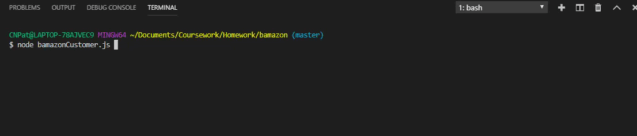
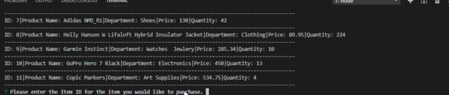
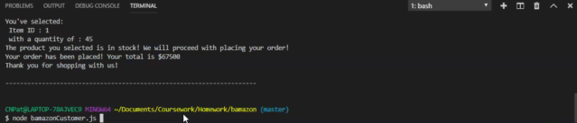
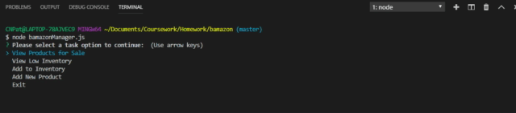
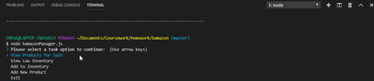
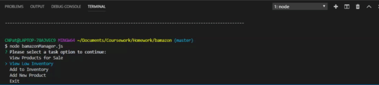
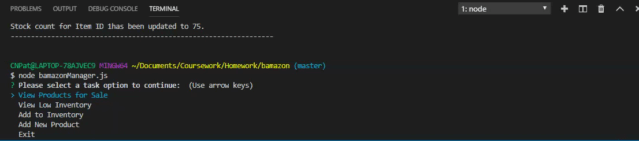

# Bamazon 

Bamazon is a command line node application which implemnents an Amazon-esc storefront using the npm [inquirer](https://www.npmjs.com/package/inquirer) package and the MySQL database backend together with the npm [mysql](https://www.npmjs.com/package/mysql) package. The application presents two interfaces: **customer** and **manager**.

## How to Use: 

* Clone this repository
* Run command "npm install" in Terminal
* In order to run this application, you will need MySQL database installed on your machine. If not, install the version needed for your operating system. Once installed, create the **Bamazon** database and the *products* table with the SQL code found in [bamazon.sql](bamazon.sql). Run this code inside your MySQL client to populate the database, then you will be able to run Bamazon customer and manager interfaces. 

## What the Customer Interface Does: 

* Prints the products available in the store.
* Prompts the customer to select a product to purchase using the Item ID. 
* Asks for the quantity: 
    * If there is a sufficient amount of the product in stock, it will return the total for that purchase.
        * Here is a preview of the Customer Startup
    

    * However, if there is not enough of the product in stock, it will tell the user that there isn't enough of the product.
    * If the purchase goes through, it updates the stock quantity to reflect the purchase.
        * Here is a preview of the Customer purchasing an item
    

        * Here is a preview of the Customer Stock Quantity Changes
    

## What the Manager Interface Does: 

* Prompts manager with a start menu to select a task option:
    * View Products for Sale
    * View Low Inventory
    * Add to Inventory 
    * Add a New Product 
    * Exit
        * Preview of Start Menu 
        

* When selecting Products for Sale it displays all products in the store and their details.
    * Preview of Products for Sale 
    
* When selecting View Low Inventory it displays all products with an inventory of less than 5 units. 
    * Preview of Low Inventory
    
* When selecting Add to Inventory it allows the manager to add units to the stock quantity of an existing product
    * Preview of Add to Inventory
    
* When selecting Add a New Product, it prompts manager in enter all details regarding the product and then populates it in the database table. 
    * Preview of Add a New Product 
    
* If the manager selects exit, it terminates the connection to the database and exits. 

## Technologies Used
* Node.js
* MySQL GUI 
* MySQL NPM Package
* Inquirer NPM Package